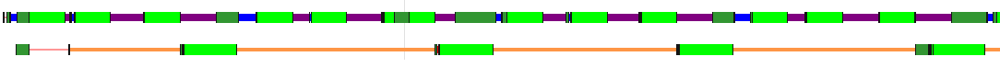
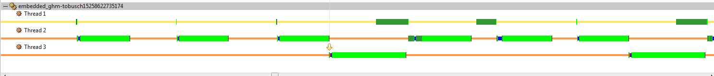

# Aufgabe 4: zyklische, kommunizierende Threads
Embedded Computing, Teilgruppe 2, Florian Tobusch - Chris Brammer


### Aufgabe 1
Thread1 wurde erstellt und mithilfe zuvor verwendeter Methoden, wie z.B nanosleep, ein Takt von 4 Millisekunden implementiert. Während dieser 4 Millisekunden arbeitet der Thread 2 Millisekunden durch die Benutzung von waste_msecs.

Die Kalibrierung von waste_msecs findet zu Programmstart auf dem Main-Thread statt. Des weiteren werden dort auch die Threads gestartet sowie die Semaphore initialisiert.
```c
// Force 1ms Systemtick
changeSystemTick(1000);

// Calibrate waste_msec
calibrate_waste_scaling();

//init semaphore
sem_init(&p1_takt, 0, 0);
sem_init(&p2_takt, 0, 0);

// Start threads
pthread_t p1_worker;
if (EOK != pthread_create(&p1_worker, NULL, &pthread_1_worker, NULL)) {
	perror("Error during thread creation");
}

pthread_t p2_worker;
if (EOK != pthread_create(&p2_worker, NULL, &pthread_2_worker, NULL)) {
	perror("Error during thread creation");
}
```

Thread 1 wird auch zur Taktgebung für Thread 2 genutzt und setzt somit alle 3 Zyklen (12 Millisekunden) ein Semaphore.
```c
waste_msec(2);
if (ticks == 2) {
	sem_post(&p2_takt);
}
ticks = (ticks + 1) % 3;
```

Thread 2 wartet auf ein Semaphore und arbeitet für 3 Millisekunden wenn dieses gesetzt wurde.

```c
while (1) {
	sem_wait(&p2_takt);
	waste_msec(3);
}
```
In der nachfolgenden Abbildung zeigt der obere Zeitstrang den Ablauf von Thread 1 und der untere Zeitstrang den Ablauf von Thread 2. Es kann klar erkannt werden das Thread 1 zwischen den Zyklen schläft (Violette Bereiche). Auch ist zu erkennen das alle 3 Takte Thread 2 signalisiert wird.


### Aufgabe 2
Um den Takt per Signal zu realisieren wird ein Timer erstellt welches das User definierte Signal ```SIGUSR1``` sendet.

Die Timererstellung ist im Code ersichtlich.
```c
// Which event to use
struct sigevent event;
SIGEV_SIGNAL_INIT(&event, SIGUSR1);

// Create timer on event
timer_t timer;
timer_create(CLOCK_REALTIME, &event, &timer);

// Start timer in interval
long timer_interval = 4000000; // 4ms
struct itimerspec itime;
itime.it_value.tv_sec = 0;
itime.it_value.tv_nsec = timer_interval;
itime.it_interval.tv_sec = 0;
itime.it_interval.tv_nsec = timer_interval;
timer_settime(timer, 0, &itime, NULL);
```

Das nun periodisch gesetzte Signal muss nun verabeitet werden. Dies kann durch einen SignalHandler realisiert werden.

```c
// Which action on signal
struct sigaction act;
sigset_t set;
sigemptyset(&set);

act.sa_flags = 0;
act.sa_mask = set;
act.sa_handler = &signal_handler; // Pointer to function

// Set action on signal
sigaction(SIGUSR1, &act, NULL);
```

Da der SignalHandler schon periodisch aufgerufen wird muss dieser nur Thread 1 signalisieren.

```c
void signal_handler(_SIG_ARGS) {
	sem_post(&p1_takt);
}
```

Anstatt den Takt nun selbst zu generieren wartet Thread 1 auf das passende Semaphor.

```c
// Wait for Tick
sem_wait(&p1_takt);

waste_msec(2);
if (ticks == 2) {
	sem_post(&p2_takt);
}
ticks = (ticks + 1) % 3;
```


